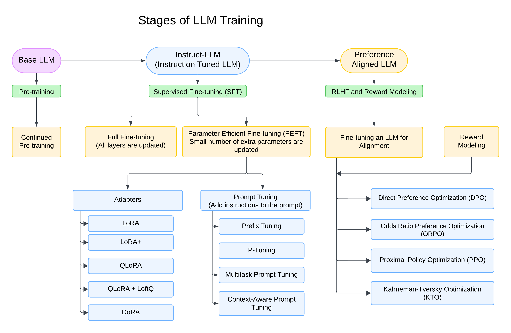

# LLM-FT-Base-Advanceo1

 

LLM Fine-Tuning
This repository provides an overview and implementation of various techniques for fine-tuning large language models (LLMs), including Supervised Fine-Tuning (SFT) and Reinforcement Learning from Human Feedback (RLHF).

Overview
Fine-tuning large pre-trained language models (LLMs) is a common practice in NLP to adapt them for specific downstream tasks. Two primary methods for fine-tuning are:

Supervised Fine-Tuning (SFT): Trains the model on labeled data to align it with specific tasks or desired behaviors.
Reinforcement Learning from Human Feedback (RLHF): Uses human feedback to refine the model's outputs, aligning them better with human preferences.
Supervised Fine-Tuning (SFT)
SFT refines a pre-trained LLM using labeled data to align it with specific tasks or desired behaviors. The model learns to map inputs to desired outputs by minimizing a supervised loss function, typically cross-entropy.

Techniques
P-tuning: Optimizes a set of learnable prompt embeddings instead of updating the entire model’s parameters. It is effective for adapting models to new tasks without extensive retraining.

Prefix Tuning: Optimizes a set of fixed-length trainable prefix tokens added to the input sequence, without modifying the model's original parameters. It is particularly effective for large language models, offering a scalable and resource-efficient alternative to full fine-tuning.

Prompt Tuning: Optimizes a set of task-specific prompt tokens, without modifying the model’s core parameters. These prompt tokens are prepended or appended to the input sequence, serving as a fixed, learnable set of parameters that guide the model's output generation.

Code Usage
Below are examples of how to train a Llama 3 model using different fine-tuning techniques on the TriviaQA dataset.

DORA
python dora.py \
    --dataset_name "triviaqa" \
    --dataset_split "train" \
    --model_id "/kaggle/input/llama-3.1/transformers/8b-instruct/2" \
    --output_dir "./trained_model" \
    --load_in_4bit True \
    --bnb_4bit_use_double_quant True \
    --bnb_4bit_quant_type "nf4" \
    --use_bfloat16 True \
    --use_cache False \
    --num_train_epochs 3 \
    --per_device_train_batch_size 1 \
    --gradient_accumulation_steps 2 \
    --gradient_checkpointing True \
    --optimizer "adamw_torch_fused" \
    --logging_steps 10 \
    --save_strategy "epoch" \
    --learning_rate 2e-4 \
    --max_grad_norm 0.3 \
    --warmup_ratio 0.03 \
    --lr_scheduler_type "constant" \
    --push_to_hub False \
    --report_to "wandb" \
    --lora_alpha 32 \
    --lora_dropout 0.1 \
    --lora_r 8 \
    --lora_bias "none" \
    --target_modules "query_key_value" \
    --use_dora True \
    --dora_ephemeral_gpu_offload True
    
LoRA
python lora.py \
    --dataset_name "triviaqa" \
    --dataset_split "train" \
    --model_id "gpt2" \
    --output_dir "./trained_lora_model" \
    --load_in_4bit True \
    --bnb_4bit_use_double_quant True \
    --bnb_4bit_quant_type "nf4" \
    --use_bfloat16 True \
    --use_cache False \
    --num_train_epochs 3 \
    --per_device_train_batch_size 1 \
    --gradient_accumulation_steps 4 \
    --gradient_checkpointing True \
    --optimizer "adamw_torch_fused" \
    --logging_steps 10 \
    --save_strategy "epoch" \
    --learning_rate 2e-4 \
    --max_grad_norm 0.3 \
    --warmup_ratio 0.03 \
    --lr_scheduler_type "constant" \
    --push_to_hub False \
    --report_to "wandb" \
    --lora_alpha 32 \
    --lora_dropout 0.1 \
    --lora_r 8 \
    --lora_bias "none" \
    --target_modules "query_key_value"
    
Prefix Tuning
python prefix_tuning.py \
    --dataset_name "triviaqa" \
    --dataset_split "train" \
    --model_id "gpt2" \
    --output_dir "./trained_lora_model" \
    --load_in_4bit True \
    --bnb_4bit_use_double_quant True \
    --bnb_4bit_quant_type "nf4" \
    --use_bfloat16 True \
    --use_cache False \
    --num_train_epochs 3 \
    --per_device_train_batch_size 1 \
    --gradient_accumulation_steps 4 \
    --gradient_checkpointing True \
    --optimizer "adamw_torch_fused" \
    --logging_steps 10 \
    --save_strategy "epoch" \
    --learning_rate 2e-4 \
    --max_grad_norm 0.3 \
    --warmup_ratio 0.03 \
    --lr_scheduler_type "constant" \
    --push_to_hub False \
    --report_to "wandb" \
    --lora_alpha 32 \
    --lora_dropout 0.1 \
    --lora_r 8 \
    --lora_bias "none" \
    --target_modules "query_key_value"
    
P-Tuning
python prefix_tuning.py \
    --dataset_name "triviaqa" \
    --dataset_split "train" \
    --model_id "bert-base-uncased" \
    --output_dir "./trained_prefix_tuning_model" \
    --load_in_4bit True \
    --bnb_4bit_use_double_quant True \
    --bnb_4bit_quant_type "nf4" \
    --use_bfloat16 True \
    --use_cache False \
    --num_train_epochs 3 \
    --per_device_train_batch_size 2 \
    --gradient_accumulation_steps 4 \
    --gradient_checkpointing True \
    --optimizer "adamw_torch_fused" \
    --logging_steps 50 \
    --save_strategy "epoch" \
    --learning_rate 3e-4 \
    --max_grad_norm 0.3 \
    --warmup_ratio 0.1 \
    --lr_scheduler_type "linear" \
    --push_to_hub False \
    --report_to "wandb" \
    --peft_type "PREFIX_TUNING" \
    --task_type "CAUSAL_LM" \
    --num_virtual_tokens 30 \
    --token_dim 768 \
    --num_transformer_submodules 1 \
    --num_attention_heads 12 \
    --num_layers 12 \
    --encoder_hidden_size 768
    
QLORA
python qlora.py \
    --dataset_name "triviaqa" \
    --dataset_split "train" \
    --model_id "gpt2" \
    --output_dir "./lora_fine_tuned_model" \
    --load_in_4bit True \
    --bnb_4bit_use_double_quant True \
    --bnb_4bit_quant_type "nf4" \
    --use_bfloat16 True \
    --use_cache False \
    --num_train_epochs 3 \
    --per_device_train_batch_size 2 \
    --gradient_accumulation_steps 4 \
    --gradient_checkpointing True \
    --optimizer "adamw_torch_fused" \
    --logging_steps 50 \
    --save_strategy "epoch" \
    --learning_rate 3e-4 \
    --max_grad_norm 0.3 \
    --warmup_ratio 0.1 \
    --lr_scheduler_type "linear" \
    --push_to_hub False \
    --report_to "wandb" \
    --lora_alpha 32 \
    --lora_dropout 0.1 \
    --lora_r 8 \
    --lora_bias "none" \
    --target_modules "query_key_value"

    
Reinforcement Learning from Human Feedback (RLHF)
RLHF involves an iterative approach to train a reward model using human feedback on the LLM’s output. This model is then used to enhance the LLM’s performance through reinforcement learning.

Techniques
Proximal Policy Optimization (PPO): Adjusts the model (policy) to align its outputs with human preferences as indicated by a reward model. It ensures stable and incremental updates through a clipping mechanism.

Direct Preference Optimization (DPO): Directly optimizes the model using the rankings or pairwise preferences collected from human feedback. It reformulates the problem as supervised learning by adjusting the model's outputs to reflect higher-ranked preferences more accurately.

Offline Reinforcement Learning with Preference Optimization (ORPO): Optimizes the policy (model) offline to maximize reward scores without interacting with a live environment. It incorporates regularization techniques, such as KL divergence constraints, ensuring the fine-tuned model stays close to the original while aligning with human preferences.
